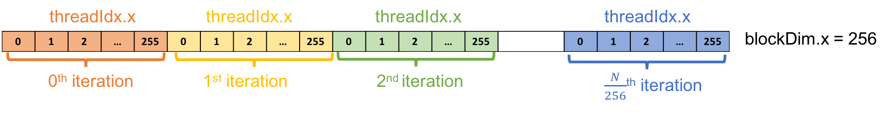
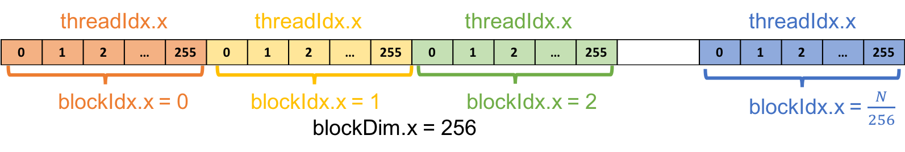

# Lab 02: CUDA in Actions

## Introduction 

In [tutorial 01](../lab01/), we implemented vector addition in CUDA using only one GPU thread. However, the strength of GPU lies in its massive parallelism. In this tutorial, we will explore how to exploit GPU parallelism. 

## Going parallel

CUDA use a kernel execution configuration `<<<...>>>` to tell CUDA runtime how many threads to launch on GPU. CUDA organizes threads into a group called "**_thread block_**". Kernel can launch multiple thread blocks, organized into a "**_grid_**" structure. 

The syntax of kernel execution configuration is as follows 

```C
<<< M , T >>>
```

Which indicate that a kernel launches with a grid of `M` thread blocks. Each thread block has `T` parallel threads. 

## Exercise 1: Parallelizing vector addition using multithread

In this exercise, we will parallelize vector addition from tutorial 01 ([`vector_add.cu`](./vector_add.cu)) using a thread block with 256 threads. The new kernel execution configuration is shown below. 

```C
vector_add <<< 1 , 256 >>> (out, d_a, b, N);
```

CUDA provides built-in variables for accessing thread information. In this exercise, we will use two of them: `threadIdx.x` and `blockIdx.x`. 

* `threadIdx.x` contains the index of the thread within the block 
* `blockDim.x` contains the size of thread block (number of threads in the thread block). 

For the `vector_add()` configuration, ะhe value of `threadIdx.x` ranges from 0 to 255 and the value of `blockDim.x` is 256.

### Parallelizing idea

Recalls the kernel of single thread version in [`vector_add.cu`](./vector_add.cu). Notes that we modified the `vector_add()` kernel a bit to make the explanation easier. 

```C
__global__ void vector_add(float *out, float *a, float *b, int n) {
    int index = 0;
    int stride = 1
    for(int i = index; i < n; i += stride){
        out[i] = a[i] + b[i];
    }
}
```

In this implementation, only one thread computes vector addition by iterating through the whole arrays. With 256 threads, the addition can be spread across threads and computed simultaneously. 

For the `k`-th thread, the loop starts from `k`-th element and iterates through the array with a loop `stride` of 256. For example, in the 0-th iteration, the `k`-th thread computes the addition of `k`-th element. In the next iteration, the `k`-th thread computes the addition of `(k+256)`-th element, and so on. Following figure shows an illustration of the idea. 



**EXERCISE: Try to implement this in `vector_add_thread.cu`**

1. Copy `vector_add.cu` to `vector_add_thread.cu`

```bash
$> cp vector_add.cu vector_add_thread.cu
```

2. Parallelize `vector_add()`. 

3. Compile and profile the program

```bash
$> nvcc vector_add_thread.cu -o vector_add_thread
$> nvprof ./vector_add_thread
```

See the solution in [`solutions/vector_add_thread.cu`](./solutions/vector_add_thread.cu)

## Exercise 2: Adding more thread blocks

CUDA GPUs have several parallel processors called **_Streaming Multiprocessors_** or **_SMs_**. Each SM consists of multiple parallel processors and can run multiple concurrent thread blocks. To take advantage of CUDA GPUs, kernel should be launched with multiple thread blocks. This exercise will expand the vector addition from exercise 1 to uses multiple thread blocks. 

Similar to thread information, CUDA provides built-in variables for accessing block information. In this exercise, we will use two of them: `blockIdx.x` and `gridDim.x`. 

* `blockIdx.x` contains the index of the block with in the grid
* `gridDim.x` contains the size of the grid

### Parallelizing idea

We will use multiple thread blocks to create `N` threads and use each thread to compute an addition of each elements. In this exercise, we will use 256 threads per thread block like Exercise 1. Assumes that `N` is divisible by 256, we need `N/256` thread blocks to have a total of at least `N` threads. Following is an illustration of the parallelization idea. 



To assign a thread to a specific element, we need a unique index for each thread. We will use variable `tid` to store this index, which can be computed as follow

```C
int tid = blockIdx.x * blockDim.x + threadIdx.x;
```

**EXERCISE: Try to implement this in `vector_add_block.cu`**

1. Copy `vector_add.cu` to `vector_add_block.cu`

```bash
$> cp vector_add.cu vector_add_thread.cu
```

2. Parallelize `vector_add()` using multiple thread blocks. 

3. Handle case when `N` is an arbitrary number. 
  * HINT: Add a condition to check that the thread work within the acceptable array index range. 

4. Compile and profile the program

```bash
$> nvcc vector_add_block.cu -o vector_add_block
$> nvprof ./vector_add_block
```

See the solution in [`solutions/vector_add_block.cu`](./solutions/vector_add_block.cu)

## Wrap up

In this tutorial, we learned about GPU threads, thread blocks, and grid. We parallized vector addition using multiple threads and multiple thread blocks. 

This tutorial should give you some rough idea of how to parallelize program on GPUs. 

## Acknowledgments

* Contents are adopted from [An Even Easier Introduction to CUDA](https://devblogs.nvidia.com/even-easier-introduction-cuda/) by Mark Harris, NVIDIA and [CUDA C/C++ Basics](http://www.int.washington.edu/PROGRAMS/12-2c/week3/clark_01.pdf) by Cyril Zeller, NVIDIA. 


